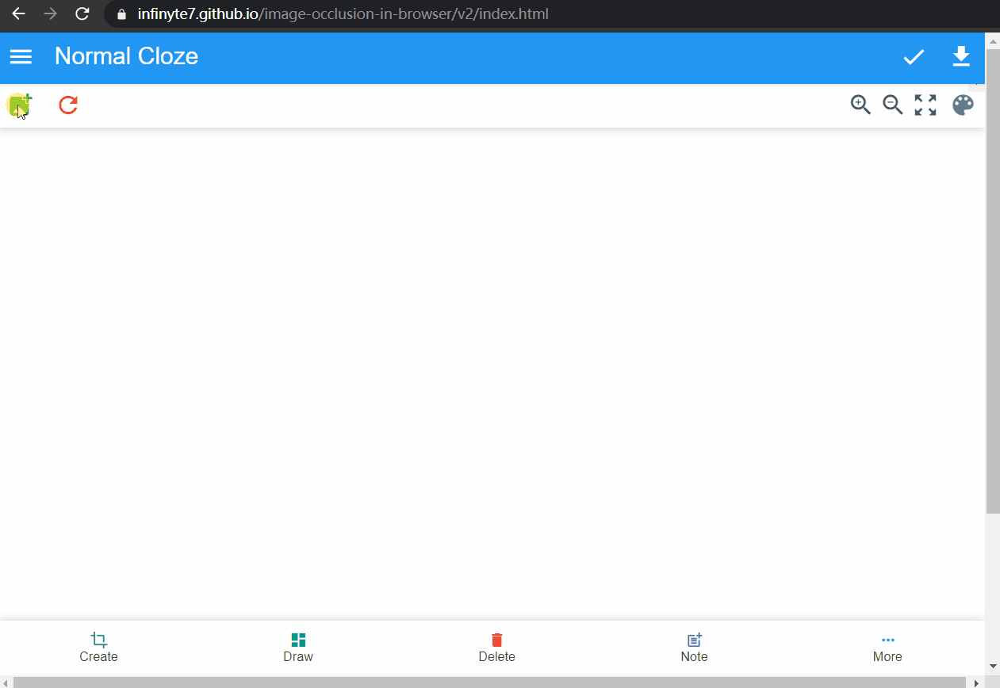

# image occlusion in browser

Create image occlusion in browser for Desktop and iOS devices v13 and v14.

#### Anki Occlusion for AnkiDroid source code moved here https://github.com/infinyte7/Anki-Occlusion

Anki Image Occlusion app used to create normal, group and combine cloze anki cards for reviewing and studying cards in Anki software (spaced repetition flashcard app, https://apps.ankiweb.net/). The cards generated by this app will be added to AnkiDroid app (Android version of Anki Software). This app is like addon for AnkiDroid. So, before using this app, please make sure you have installed AnkiDroid on your device.

For desktop and iOS, web version of the app can be used. It create ready to import deck for Anki.

# QuickStart
https://infinyte7.github.io/image-occlusion-in-browser/v2/index.html

#### Note: Rename and remove .zip at end of exported deck if present .zip extension to import in AnkiMobile

## Update
- Check PWA version of this project. It can be run offline.

    https://infinyte7.github.io/image-occlusion-in-browser/pwa/index.html

- View [How to install PWA on desktop](demo/install_pwa.gif)

### Version 2 (For desktop and iOS 13 & 14)
- Create image occlusion anki deck inside browser.
- Download ready to import deck
- Deck generated using [genanki](https://github.com/kerrickstaley/genanki) python module using [pyodide](https://github.com/iodide-project/pyodide)


### View updates
[Changelog.md](Changelog.md)


# Tutorials / Features
- [PWA version for offline use](demo/install_pwa.gif)
- [Create multiple cards in same deck](demo/multiple_cards.gif)
- [Create rectangles](demo/demo_draw_anywhere.gif)
- [Create ellipse](https://github.com/infinyte7/image-occlusion-in-browser/blob/master/demo/demo_multiple_polygon.gif)
- [Create textbox](https://github.com/infinyte7/image-occlusion-in-browser/blob/master/demo/demo_text_box.gif)
- [Create polygon](https://github.com/infinyte7/image-occlusion-in-browser/blob/master/demo/demo_multiple_polygon.gif)
- [Create normal cloze](demo/demo_create.gif)
- [Create group cloze](demo/demo_group_element.gif)
- [Create combine cloze](demo/combine_cloze_demo_browser.gif)
- [Change color of masks](demo/demo_change_color.gif)
- [Undo / Redo feature](https://github.com/infinyte7/image-occlusion-in-browser/blob/master/demo/demo_undo_redo.gif)


## Create Anki decks in four steps
1. Select image to editor window
2. Draw rectangles, ellipses, polygons or textbox
3. Add to decks
4. Download the decks
5. On smartphones the decks download with.zip extension, so rename and remove .zip to import in AnkiMobile.

### Demo


### Version 1
https://infinyte7.github.io/image-occlusion-in-browser

Download ```output-all-notes.txt``` and generate deck using this [python script](https://github.com/infinyte7/image-occlusion-in-browser/blob/master/image-occ-deck-export.py).

[Read more](Create-In-Browser.md)<br>
[View demo](demo/combine_cloze_demo_browser.gif)

# Faq ?
### How to change question and answer rectangles mask color?
Go to settings and put valid hex color.

View hex color example https://www.materialpalette.com/colors

### How to group cloze with different color?
1. Draw rectangles
2. Go to settings and change question mask color
3. Click top right image button, then click rectangles. It will change rectangles color. The rectangles with new color will be added to list.
4. Again click top right image button to stop adding rectangles to list. 
5. Click done to add data to AnkiDroid.
6. Repeat from step 2 to step 5 for creating group cloze with different color.

### How to group cloze with different color in same cloze ?
1. Draw rectangles
2. Select group cloze button (top right) add rectangles to list.
3. Change question mask color from settings
4. Select more rectangles to list
5. Finally click done button to add notes data to AnkiDroid

View [demo](https://user-images.githubusercontent.com/12841290/95605099-0d038b00-0a8b-11eb-81ed-58a7e03c254e.gif)

# Contributions
This is implemented using javascript. It has bugs and issues. Any contributions to improvement of codes and features will be appreciated.

# License
View [License](License.md)