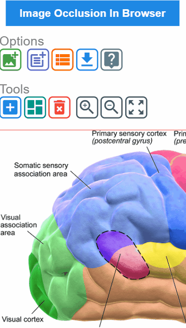
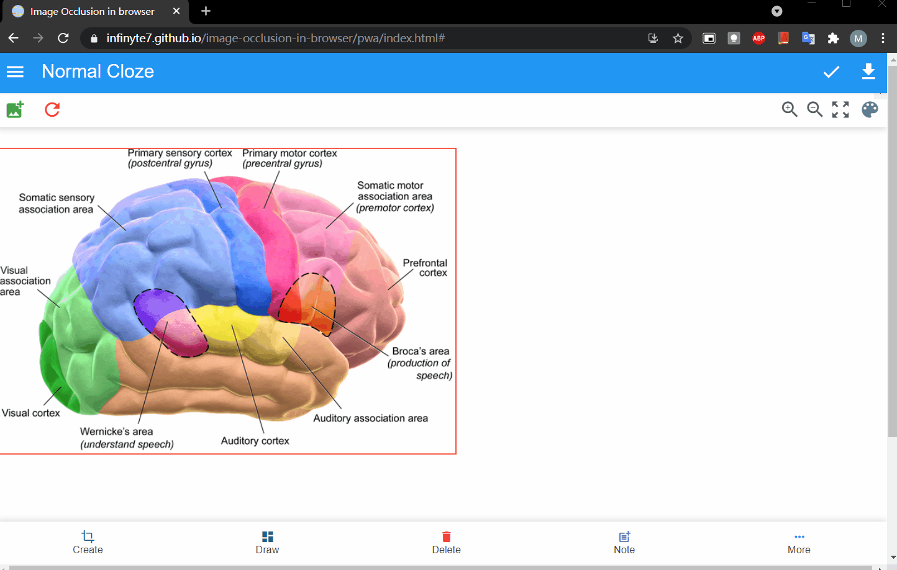

# image-occlusion-in-browser

Create image occlusion in browser. 

For desktop there is already addon for creating image occlusion. This is implementation for using mobile and creating deck with image occlusion.


# Demo
</img> | </img> | </img>

# Tutorials / Features
- [Create question and answer mask](demo/demo_create.gif)
- [Create rectangles by tapping two point anywhere inside editor window](demo/demo_draw_anywhere.gif)
- [Create group question and answer mask](demo/demo_group_element.gif) (Need improvements)
- [Change color of masks](demo/demo_change_color.gif)
- [Export deck on mobile using browser](demo/demo_create_deck.gif)
- [Export deck on mobile using Pydroid 3](demo/demo_pydroid_3.gif)
- [Using offline](demo/demo_img_occ.gif)


# Create deck using Android app [Anki Image Occlusion]
- Download from Github release page.
https://github.com/infinyte7/image-occlusion-in-browser/releases

- First, make sure to give storage and additional permissions
- Create card click on download icon.
- Card will be added one by one. But wait till ```card added``` toast showing on screen.
- Copy svg image from ```Internal Storage/ Android/ data/ io.infinyte7.ankiimageocclusion/ files/``` and original image file to AnkiDroid ```collection.media``` folder.

### Demo
</img>


# Create image occlusion Anki decks in three steps using only browser

## Step 1 - Create svg question and answers mask 

1. - Visit [https://infinyte7.github.io/image-occlusion-in-browser/](https://infinyte7.github.io/image-occlusion-in-browser/)
   - To create group cloze, view this
<br> [https://infinyte7.github.io/image-occlusion-in-browser/group.html](https://infinyte7.github.io/image-occlusion-in-browser/group.html)

2. Add rectangles to editor window by pressing "+" in tools.
(Drag or resize to specific location)

3. Add notes for the image

4. Download the notes. It will download svg question masks, answer masks, ```output-note.txt``` and also it will add individual note to view note window.

5. Then download combined notes from view note window. It will download ```output-all-notes.txt``` file. This file will be used to create deck.

## Step 2 - Copy all svg files to AnkiDroid folder
1. Copy question and answer svg files and original image to ```collection.media``` folder

## Step 3 - Generate decks using Pydroid 3 or Use Google colab to run the script
### Step 3 (a)
1. Download and install Pydroid 3 from play store.
2. Install ```genanki``` in Pydroid using Pip. View demo below.
3. Download ```image-occ-deck-export.py``` from release page.
4. Open ```image-occ-deck-export.py``` in Pydroid 3 and run
5. Select ```output-all-notes.txt``` and import 
6. Enter deck details and export.

View demo [Generate deck using Pydroid 3](demo/demo_pydroid_3.gif)

### Step 3 (b)
The deck can also be generate without installing any software using Google colab.
1. Due to some reason, I have removed it. 

   <s>View this link
https://colab.research.google.com<span></span>/drive/1FH_ylTPG-HgZauFsk6sk58B0OVJK4yLw?usp=sharing</s>

   But code can be used by copying [deck_export_console.py](deck_export_console.py) to Google colab.

   <br>a) Click on [Raw](https://raw.githubusercontent.com/infinyte7/image-occlusion-in-browser/master/deck_export_console.py) and copy all code
<br>b) Login to https://colab.research.google.com and paste all the code.
<br>c) If getting any error then copy this and run it 
   ```
   !pip install genanki
   ```
<br>
2. Upload ```output-all-notes.txt``` file
a) Click top left icon
b) Show file browser  

```
connecting to a runtime to enable file browsing
```
   
c) click to upload output-all-notes.txt

3. Tap on play icon to install ```genanki```
```
!pip install genanki
```
4. Tap on next to run and export
```
Enter filename with extension: output-all-notes.txt           # uploaded file name  
Enter title of the deck: learn                                # any title
```
Enter details and it will create the deck

5. Download the deck from Show file browser

View demo: [Generate deck using Google colab in browser](demo/demo_export_from_browser.gif)

# Requirements for running it offline
1. Termux or any app that create localhost
2. Pydroid 3

Download from playstore.

# Steps for running offline

1. If using termux then install ```python```
```
pkg install python
```
2. Download files from release page
3. Extract to any folder
4. Use termux to traverse to that folder using 

```
cd storage/downloads/image-occlusion-in-browser
```
5. Run localhost

```
python -m http.server
```

6. Open chrome and enter url
```
localhost:8000
```
7. First, add image then add rectangle. After adding notes, click on download to get svg files with question mask and answer mask. 

8. Copy all the files (svg files and original image) to ```collection.media``` folder

9. Now open ```Pydroid 3``` and open ```image-occ-deck-export.py``` and import ```output.txt``` file and generate deck by entering name, model and title.

10. Import it in AnkiDroid and start reviewing.

View demo: [Using offline](demo/demo_img_occ.gif)

# Contributions
This is implemented using javascript. It has bugs and issues. Any contributions to improvement of codes and features will be appreciated.

# License
## Deck Template
AGPL-3.0 License
<br>Copyright (c) glutanimate
<br>https://github.com/glutanimate/image-occlusion-enhanced

## svg.js and its plugins
Copyright (c) 2012-2018 Wout Fierens
<br>https://svgdotjs.github.io/

## Image in demo
Wikipedia

## image occlusion in browser
MIT License
<br>Copyright (c) 2020 Mani
