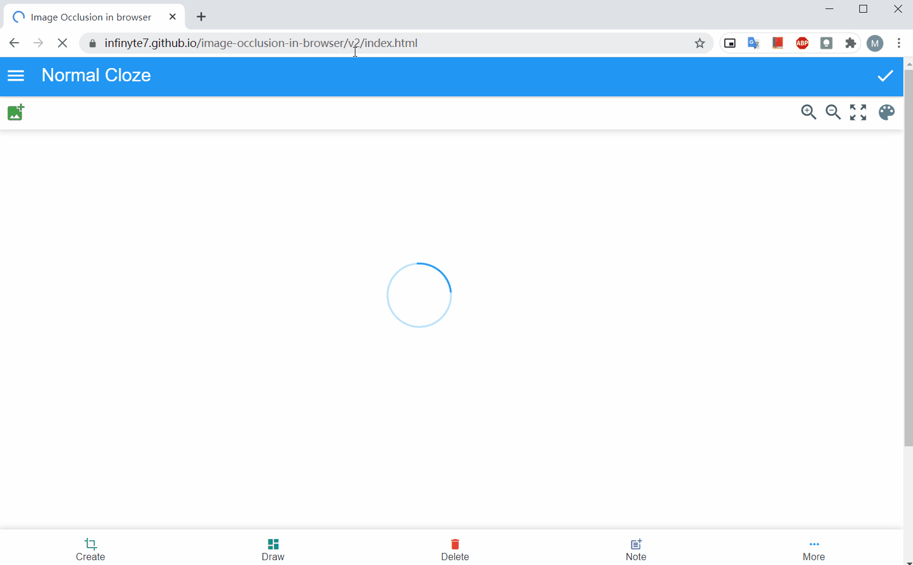

# image occlusion in browser

Create image occlusion in browser.

Anki Image Occlusion app used to create normal, group and combine cloze anki cards for reviewing and studying cards in Anki software (spaced repetition flashcard app, https://apps.ankiweb.net/). The cards generated by this app will be added to AnkiDroid app (Android version of Anki Software). This app is like addon for AnkiDroid. So, before using this app, please make sure you have installed AnkiDroid on your device.

For desktop and iOS, web version of the app can be used. It create ready to import deck for Anki.

# Tutorials / Features
- [Create rectangles](demo/demo_draw_anywhere.gif)
- [Create ellipse](https://github.com/infinyte7/image-occlusion-in-browser/blob/master/demo/demo_multiple_polygon.gif?raw=true)
- [Create textbox](https://github.com/infinyte7/image-occlusion-in-browser/blob/master/demo/demo_text_box.gif?raw=true)
- [Create polygon](https://github.com/infinyte7/image-occlusion-in-browser/blob/master/demo/demo_multiple_polygon.gif?raw=true)
- [Create normal cloze](demo/demo_create.gif)
- [Create group cloze](demo/demo_group_element.gif)
- [Create combine cloze](demo/combine_cloze_demo_browser.gif)
- [Change color of masks](demo/demo_change_color.gif)
- [Undo / Redo feature](https://github.com/infinyte7/image-occlusion-in-browser/blob/master/demo/demo_undo_redo.gif?raw=true)

# Browser
https://infinyte7.github.io/image-occlusion-in-browser/v2/index.html

#### Version 2 (For desktop and iOS 13 & 14)
- Create image occlusion anki deck inside browser.
- Download ready to import deck
- Deck generated using [genanki](https://github.com/kerrickstaley/genanki) python module using [pyodide](https://github.com/iodide-project/pyodide)

### Demo

<br><br>
# Android
## Create deck using Android app [Anki Image Occlusion]
**App Features**
   - New design
   - Cards auto added to AnkiDroid
   - Group cloze card generation simplified
   - **Selected image and generated SVG auto copy to ```AnkiDroid/collection.media/``` folder.**

The app made using [Apache Cordova](https://cordova.apache.org/) and [AnkiDroid API](https://github.com/ankidroid/Anki-Android/wiki/AnkiDroid-API) with ```HTML/CSS/JS```.

## Usage

To use this app. (This app is like addon for AnkiDroid app)
### 1. Install [AnkiDroid](https://github.com/ankidroid/Anki-Android)

   - Enable AnkiDroid API <br>
```AnkiDroid -> Settings -> Advanced -> Enable AnkiDroid API (Turn on)```

      Because this app add data to AnkiDroid app folder.

### 2. Install Anki Image Occlusion
   Download and install Anki Image Occlusion app from release page.

   https://github.com/infinyte7/image-occlusion-in-browser/releases
### 3. Give app permissions 
   Give ```storage``` and ```AnkiDroid database read and write permissions``` from app settings.
### 4. Import image 
   Select image from storage (top left corner image button).
### 5. Add rectangles
   Draw rectangles (bottom left draw button).
      - First select ```draw``` button then tap inside image at ```two point```, top left and bottom right, for creating box of that width and height.
### 6. Done
   Then click done button (top right corner button).

This will copy selected image, generated svg and notes data to AnkiDroid app.

### Demo
</img>


## For Version <= Version 1.1.1
If not using latest version then following steps to be followed.
- Create card click on download icon.
- Card will be added one by one. But wait till ```card added``` toast showing on screen.
- Copy svg image from ```Internal Storage/ Android/ data/ io.infinyte7.ankiimageocclusion/ files/``` and original image file to AnkiDroid ```collection.media``` folder.

### Using web version of this app.

### Version 1
https://infinyte7.github.io/image-occlusion-in-browser

Download ```output-all-notes.txt``` and generate deck using this [python script](https://github.com/infinyte7/image-occlusion-in-browser/blob/master/image-occ-deck-export.py).

[Read more](Create-In-Browser.md)<br>
[View demo](demo/combine_cloze_demo_browser.gif)

# Create image occlusion on Desktop
 View [Create image occlusion on desktop](desktop/Readme.md)

# Create image occlusion in browser
View [Create image occlusion in browser](Create-In-Browser.md)

# Create image occlusion offline
View [Create image occlusion Offline](Create-Offline.md)


# Build Anki Image Occlusion android app
Fork this repo and remove demo folder from the forked repo. Then download the repo.
1. Download this repository
2. Open ```android``` folder in Android Studio
3. Build and generate apk

# Faq ?
### Why is card not added to AnkiDroid?
1. Check app permission from app settings
```
Storage 
AnkiDroid app database read and write
```
2. Check ```Enable AnkiDroid API```

```AnkiDroid -> Settings -> Advanced -> Enable AnkiDroid API (Turn on)```

### Why is images not synced to Anki Desktop? 
In AnkiDroid, click ```check media``` then ```sync```. The images will be synced.

### How to change question and answer rectangles mask color?
Go to settings and put valid hex color.

View hex color example https://www.materialpalette.com/colors

### How to group cloze with different color?
1. Draw rectangles
2. Go to settings and change question mask color
3. Click top right image button, then click rectangles. It will change rectangles color. The rectangles with new color will be added to list.
4. Again click top right image button to stop adding rectangles to list. 
5. Click done to add data to AnkiDroid.
6. Repeat from step 2 to step 5 for creating group cloze with different color.

### How to group cloze with different color in same cloze ?
1. Draw rectangles
2. Select group cloze button (top right) add rectangles to list.
3. Change question mask color from settings
4. Select more rectangles to list
5. Finally click done button to add notes data to AnkiDroid

View [demo](https://user-images.githubusercontent.com/12841290/95605099-0d038b00-0a8b-11eb-81ed-58a7e03c254e.gif)

# Contributions
This is implemented using javascript. It has bugs and issues. Any contributions to improvement of codes and features will be appreciated.

# License
View [License](License.md)