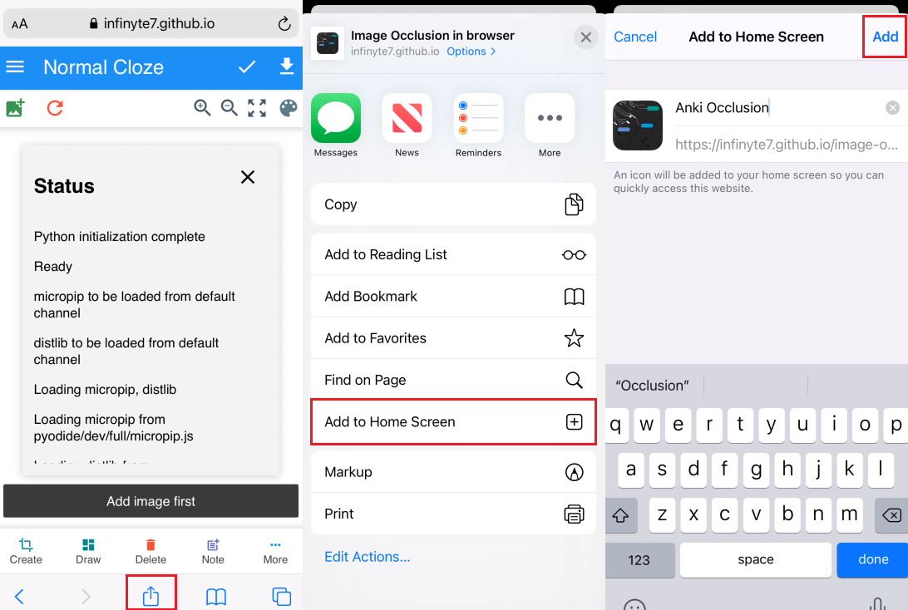

# image occlusion in browser version 2 (deprecated)

>### Note: Version 2 of this project is deprecated. Version 1 and 2 will not be updated, so use [version 3](https://krmanik.github.io/image-occlusion-in-browser/v3/index.html) of the project to create decks.

<br>
Create image occlusion in browser for Desktop and iOS devices v13 and v14.

Anki decks created using [genanki](https://github.com/kerrickstaley/genanki) Python module using [pyodide](https://github.com/iodide-project/pyodide) to run inside browser and JavaScript library [svg.js](https://svgdotjs.github.io/). It creates ready to import decks for Anki and AnkiMobile.

#### Note: if .zip extension present in export deck file name, then rename and remove .zip
<br>

### QuickStart
Open following websites in browser and start creating image occlusion decks. Wait for loading the page. It downloads approx. 30 mb files inside browser.

https://krmanik.github.io/image-occlusion-in-browser/pwa/index.html

View [Supported devices list](Supported%20Devices.md)

### Note: If the website is not updated, then may be cache for the website should be cleared from settings in browser.

View [how to install for offline use](demo/pwa_install_ios.gif).<br>
Read more about [Progressive Web App](https://en.wikipedia.org/wiki/Progressive_web_application)

<br>



<br>

## Demo
#### [Desktop](demo/multiple_cards.gif)
#### [iOS v13](demo/iOSv13_demo.gif)

### Version 1 (Removed)
https://krmanik.github.io/image-occlusion-in-browser

Download ```output-all-notes.txt``` and generate deck using this [python script](https://github.com/krmanik/image-occlusion-in-browser/blob/master/image-occ-deck-export.py).

[Read more](Create-In-Browser.md)<br>
[View demo](demo/combine_cloze_demo_browser.gif)
