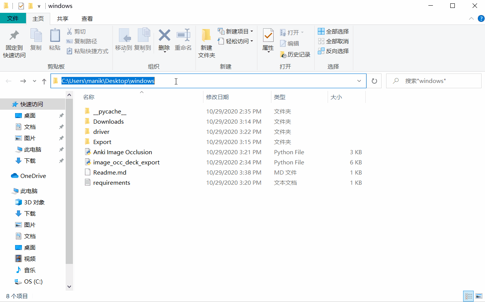

# To run this program, install following
1. Python
2. Chrome

# Setup
Install following python module

```
pip install -r requirements.txt
```

# Steps to create Image Occlusion deck
1. Run ```Anki Image Occlusion.py``` file

2. Click ```Start```, it shall open chrome. Wait for page to load.

3. Create image occlusion by importing image and drawing rectangles.

4. Click done button

5. Repeat step 3, 4 and 5, to create more image occlusion

6. Finally, click ```Export``` button to generate decks.

# Demo

